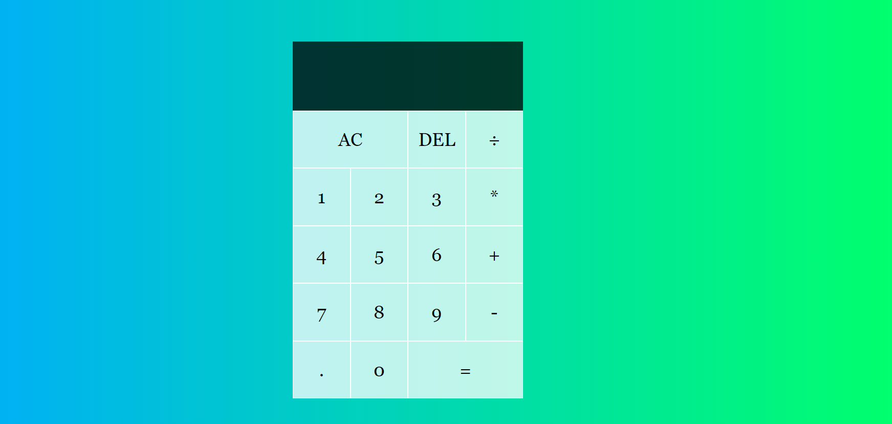

# <div align="center">📋 Vanilla JavaScript Calculator</div>
<a href="https://todoapp-5aa6c.web.app"/>

                             </a>
<p align="center">
Pure vanilla JavaScript calculator using modern ES6 syntax and classes</p>

## 🛠️ Technologies

<ul>
  <li><a href="https://www.javascript.com/">JavaScript/a></li>
  <li><a href="https://www.w3schools.com/css/">CSS</a></li>
</ul>

## ⚙️ Requirements

<ul>
  <li><a href="https://git-scm.com/">Git</a></li>
  
</ul>

## 🚀 Installation

```
$ git clone https://github.com/gabrielpasquantonio/Vanilla-JavaScript-Calculator.git
$ cd Vanilla-JavaScript-Calculator
$ npm install
$ npm start
```

The application will open in the browser on http://localhost:3000
